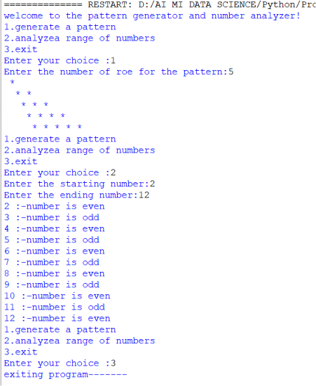

# Interactive Personal Data Collector

A beginner-friendly Python project that collects personal information from the user and displays the entered details along with their data types and memory addresses.

## 📌 Features
- Collects user's name
- Takes age input
- Takes height in meters
- Takes favourite number
- Displays:
  - User data
  - Data types (`str`, `int`, `float`)
  - Memory addresses using `id()`
- Simple and easy-to-understand Python project

## 🖥️ Python Code

```python
print("welcome to the interactive personal data collector!\n")

name=input("please enter your name:")
age=int(input("please enter your age:"))
height=float(input("please enter your height in meters:"))
fav_number=int(input("please enter your favourite number:"))

print("your birth year is approximately:2009 based on your age of 17")

print(f"name: {name} (type:{type(name)}, memory address:{id(name)})")
print(f"age: {age} (type:{type(age)}, memory address:{id(age)})")
print(f"height: {height} {type(height)},memory addeess:{id(height)})")
print(f"favourite number:{fav_number}{type(fav_number)},memory address:{id(fav_number)})")

print("Thank you for using the personal data collector. Goodbye!")
```

## ▶️ Example Output



Example result from the program:

```text
welcome to the interactive personal data collector!

please enter your name: yashvi
please enter your age: 17
please enter your height in meters: 1.75
please enter your favourite number: 9

your birth year is approximately:2009 based on your age of 17

name: yashvi (type:<class 'str'>, memory address:1679559376304)
age: 17 (type:<class 'int'>, memory address:140714756048504)
height: 1.75 <class 'float'>,memory addeess:1679559132560)
favourite number:9<class 'int'>,memory address:140714756048248)

Thank you for using the personal data collector. Goodbye!
```

## 📚 Concepts Used
- Variables
- User Input
- Data Types
- Type Casting (`int`, `float`)
- Formatted Strings (`f-strings`)
- Memory Address using `id()`

## 🚀 How to Run
1. Install Python
2. Save the file as `personal_data_collector.py`
3. Open terminal or command prompt
4. Run:

```bash
python personal_data_collector.py
```

## 👨‍💻 Author
Created as a Python learning and practice project.