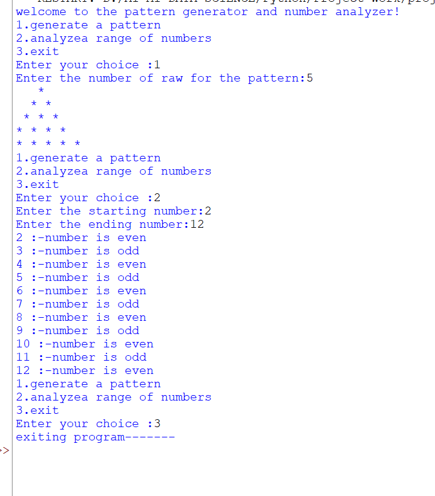

<<<<<<< HEAD
# 🌟 Pattern Generator & Number Analyzer 🐍

<div align="center">


✨ A fun and interactive Python project to generate star patterns and analyze numbers! ✨

</div>

---

# 📌 About The Project

This is a **Python beginner-friendly project** that allows users to:

⭐ Generate beautiful star patterns  
🔢 Analyze a range of numbers (Even/Odd)  
🚪 Exit the program smoothly

This project is great for practicing:

- `while loop`
- `match-case`
- `for loop`
- Nested loops
- `if-else` conditions
- User input handling

---

# 🎯 Features

## ⭐ Pattern Generator
- Generates a star (`*`) pattern
- User can select number of rows

### Example Pattern Output
```text
*
* *
* * *
* * * *
* * * * *
```

---

## 🔍 Number Analyzer
- Checks numbers in a given range
- Identifies whether the number is:

✅ Even Number  
🔹 Odd Number

### Example
```text
2 :- number is even
3 :- number is odd
4 :- number is even
```

---

# 🖼️ Project Output

## Program Execution Screenshot

> Add your screenshot image in project folder with name **output.png**

```md

```

---

# 💻 Python Code

```python
print("welcome to the pattern generator and number analyzer!")

while True:
    print("1.generate a pattern")
    print("2.analyzea range of numbers")
    print("3.exit")

    choice = int(input("Enter your choice :"))

    match choice:
        case 1:
            rawnumber = int(input("Enter the number of roe for the pattern:"))

            for i in range(1, rawnumber + 1):
                for _ in range(1, i + 1):
                    print(" ", end="")

                for j in range(1, i + 1):
                    print("*", end=" ")

                print()

        case 2:
            start = int(input("Enter the starting number:"))
            end = int(input("Enter the ending number:"))

            for i in range(start, end + 1):
                if i % 2 == 0:
                    print(i, end=" ")
                    print(":-number is even")
                else:
                    print(i, end=" ")
                    print(":-number is odd")

        case 3:
            print("exiting program-------")
            break

        case _:
            print("wrong choice")
```

---

# ▶️ How To Run

### Step 1: Install Python
Download Python from:

https://www.python.org/

### Step 2: Save File
Save your Python file as:

```text
pattern_generator.py
```

### Step 3: Run Program

```bash
python pattern_generator.py
```

---

# 📂 Project Structure

```text
📁 Project Folder
│── pattern_generator.py
│── README.md
│── output.png
```

---

# 🚀 Future Improvements

- Add more pattern styles
- Prime number checker
- Sum of numbers feature
- Better UI formatting

---

<div align="center">

## ⭐ If you like this project, give it a star ⭐

Made with ❤️ using **Python**

=======
# 🌟 Pattern Generator & Number Analyzer 🐍

<div align="center">


✨ A fun and interactive Python project to generate star patterns and analyze numbers! ✨

</div>

---

# 📌 About The Project

This is a **Python beginner-friendly project** that allows users to:

⭐ Generate beautiful star patterns  
🔢 Analyze a range of numbers (Even/Odd)  
🚪 Exit the program smoothly

This project is great for practicing:

- `while loop`
- `match-case`
- `for loop`
- Nested loops
- `if-else` conditions
- User input handling

---

# 🎯 Features

## ⭐ Pattern Generator
- Generates a star (`*`) pattern
- User can select number of rows

### Example Pattern Output
```text
*
* *
* * *
* * * *
* * * * *
```

---

## 🔍 Number Analyzer
- Checks numbers in a given range
- Identifies whether the number is:

✅ Even Number  
🔹 Odd Number

### Example
```text
2 :- number is even
3 :- number is odd
4 :- number is even
```

---

# 🖼️ Project Output

## Program Execution Screenshot

> Add your screenshot image in project folder with name **output.png**

```md

```

---

# 💻 Python Code

```python
print("welcome to the pattern generator and number analyzer!")

while True:
    print("1.generate a pattern")
    print("2.analyzea range of numbers")
    print("3.exit")

    choice = int(input("Enter your choice :"))

    match choice:
        case 1:
            rawnumber = int(input("Enter the number of roe for the pattern:"))

            for i in range(1, rawnumber + 1):
                for _ in range(1, i + 1):
                    print(" ", end="")

                for j in range(1, i + 1):
                    print("*", end=" ")

                print()

        case 2:
            start = int(input("Enter the starting number:"))
            end = int(input("Enter the ending number:"))

            for i in range(start, end + 1):
                if i % 2 == 0:
                    print(i, end=" ")
                    print(":-number is even")
                else:
                    print(i, end=" ")
                    print(":-number is odd")

        case 3:
            print("exiting program-------")
            break

        case _:
            print("wrong choice")
```

---

# ▶️ How To Run

### Step 1: Install Python
Download Python from:

https://www.python.org/

### Step 2: Save File
Save your Python file as:

```text
pattern_generator.py
```

### Step 3: Run Program

```bash
python pattern_generator.py
```

---

# 📂 Project Structure

```text
📁 Project Folder
│── pattern_generator.py
│── README.md
│── output.png
```

---

# 🚀 Future Improvements

- Add more pattern styles
- Prime number checker
- Sum of numbers feature
- Better UI formatting

---

<div align="center">

## ⭐ If you like this project, give it a star ⭐

Made with ❤️ using **Python**

>>>>>>> 5d00c5bee2062ea43552701618b90904b5294925
</div>